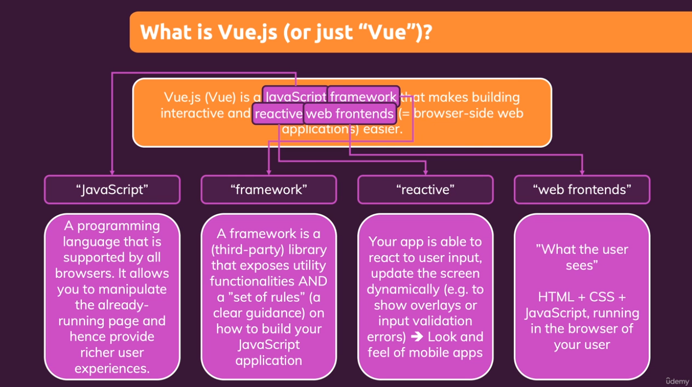
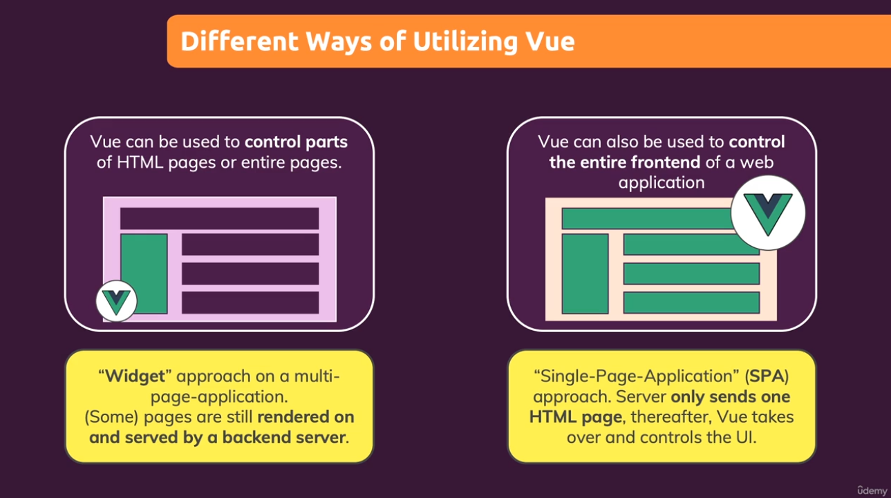
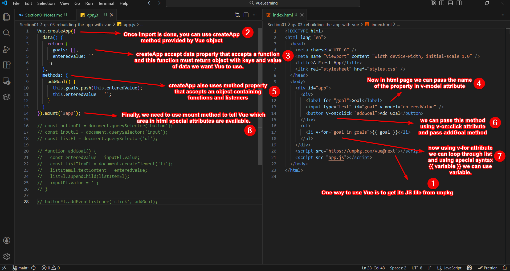

# Section 1 - Understanding Vue

## What is Vue.JS?
Vue is a **javascript framework** that help us to make **reactive web app**.

## What are Different Ways To Use Vue JS?

Vue can be used to **control parts of a HTML page** or it can be used to **control HTML page as a SPA**.

## First Vue App

