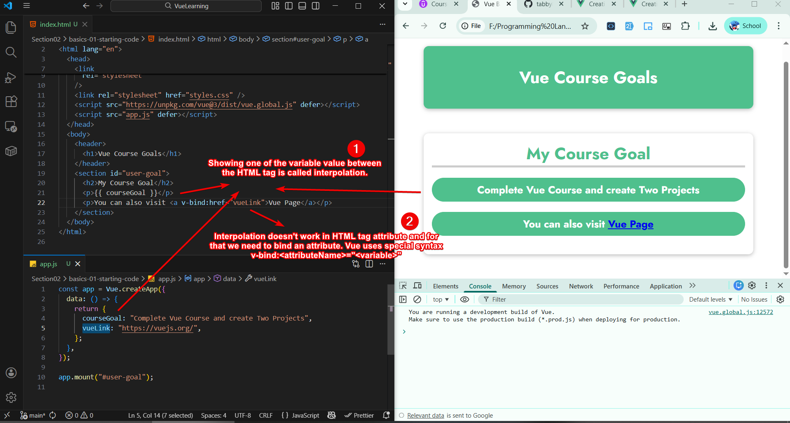
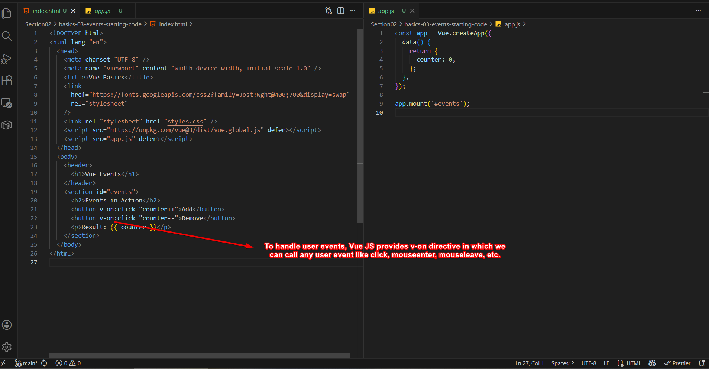
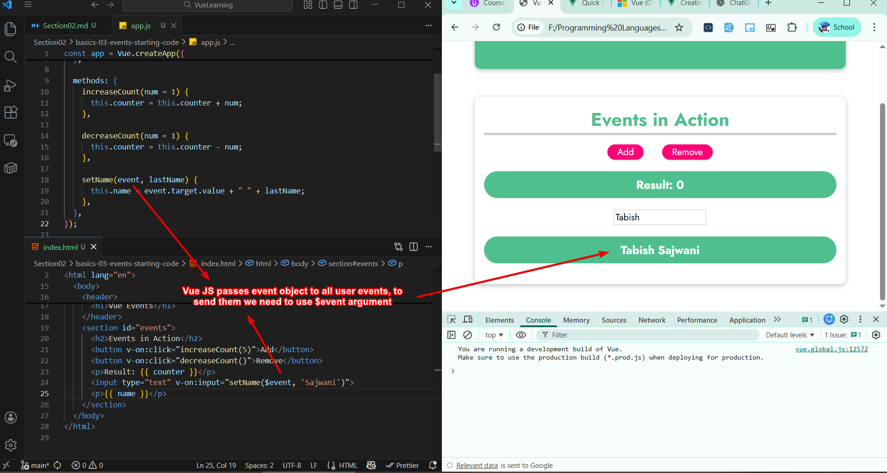
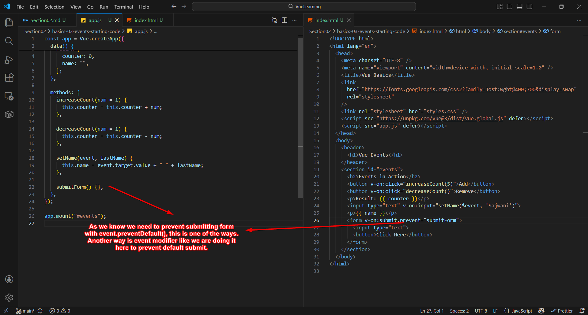
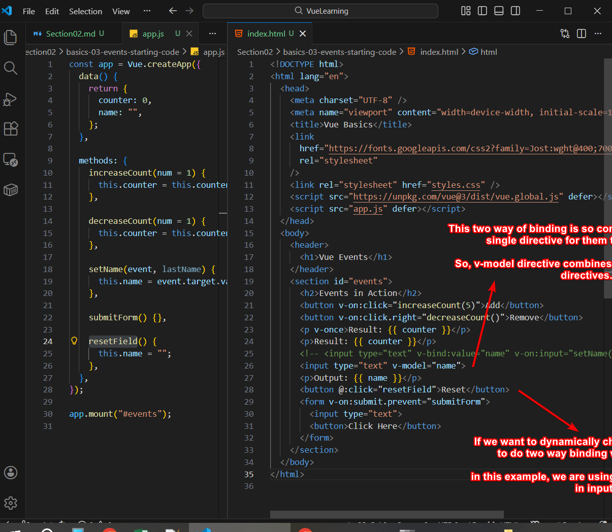
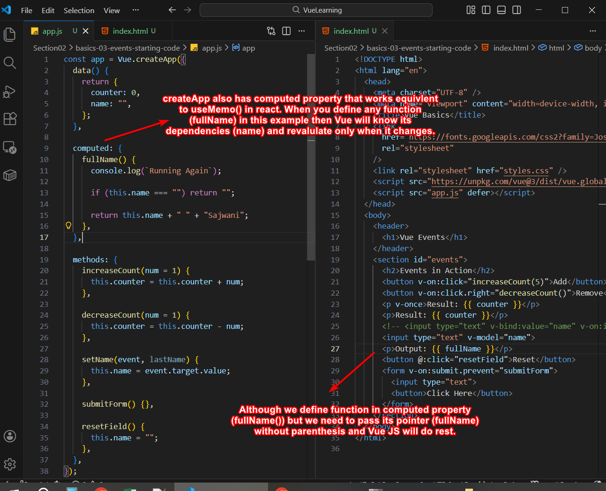
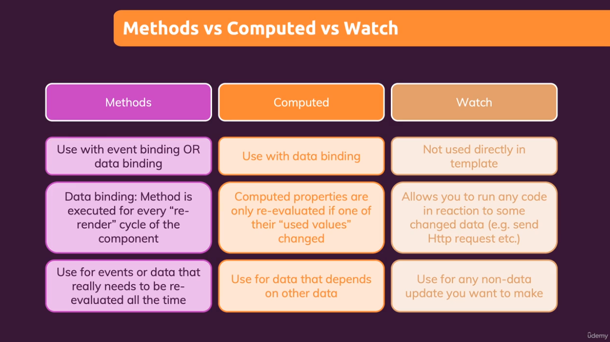
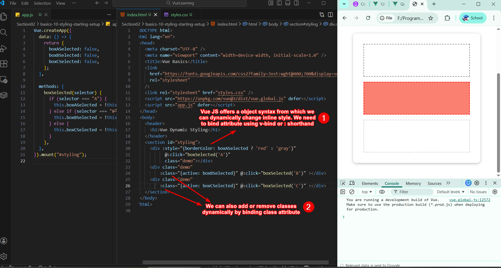
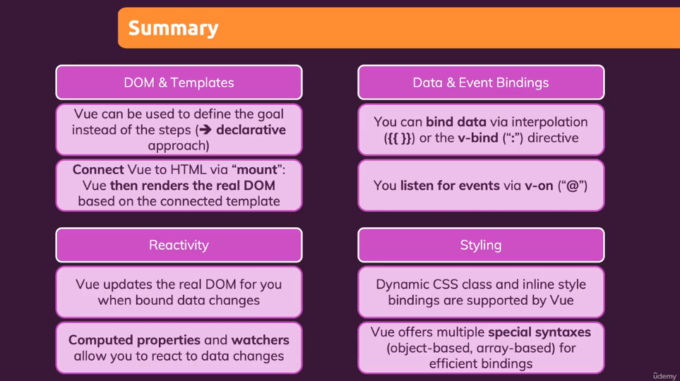

# Section 02 - Vue Core Concepts

## Using Interpolation and v-bind



`Interpolation` can also be used to return function value, or writing simple Javascript but not for complex if-statements and loops. Like

``` javascript
const app = Vue.createApp({
  data: () => {
    return {
      courseGoal: "Complete Vue Course and create Two Projects",
      vueLink: "https://vuejs.org/",
    };
  },
  methods: {
    createGoal() {
      if (Math.random() < 0.5) {
        return "Learn Vue";
      } else {
        return "Master Vue";
      }
    },
  },
});

app.mount("#user-goal");
```

``` html
<section id="user-goal">
    <h2>My Course Goal</h2>
    <p>{{ createGoal() }}</p>
    <p>You can also visit <a v-bind:href="vueLink">Vue Page</a></p>
</section>
```

`v-bind` is special feature in Vue that binds HTML attribute.

## Using Data Variables Inside App

We can also use data varibles inside methods using `this` keyword, because Vue makes **data variable access globally** in createApp object. So, `this` refer to createApp object.

``` javascript
const app = Vue.createApp({
  data: () => {
    return {
      courseGoalA: "Complete Vue Course",
      courseGoalB: "Create Two Vue + Laravel Projects",
      vueLink: "https://vuejs.org/",
    };
  },
  methods: {
    createGoal() {
      if (Math.random() < 0.5) {
        return this.courseGoalA;
      } else {
        return this.courseGoalB;
      }
    },
  },
});

app.mount("#user-goal");
```

## Rendering Raw HTML

You can **render raw html** using `v-html` attribute in html tags

``` javascript
const app = Vue.createApp({
  data: () => {
    return {
      courseGoalA: "Complete Vue Course",
      courseGoalB: "<i>Create Two Vue + Laravel Projects</i>",
      vueLink: "https://vuejs.org/",
    };
  },
  methods: {
    createGoal() {
      if (Math.random() < 0.5) {
        return this.courseGoalA;
      } else {
        return this.courseGoalB;
      }
    },
  },
});

app.mount("#user-goal");
```

``` html
<body>
    <header>
      <h1>Vue Course Goals</h1>
    </header>
    <section id="user-goal">
      <h2>My Course Goal</h2>
      <!-- <p>{{ createGoal() }}</p> -->
      <p v-html="createGoal()"></p>
      <p>You can also visit <a v-bind:href="vueLink">Vue Page</a></p>
    </section>
  </body>
```

## User Events



Using `v-on` directive and then specifying event name, we can control event listerener in Vue.js

It is good practice to pass `callback functions` in event listeners

``` javascript
const app = Vue.createApp({
  data() {
    return {
      counter: 0,
    };
  },

  methods: {
    increaseCount(num = 1) {
      this.counter = this.counter + num;
    },

    decreaseCount(num = 1) {
      this.counter = this.counter - num;
    },
  },
});

app.mount("#events");
```

``` html
<section id="events">
  <h2>Events in Action</h2>
  <button v-on:click="increaseCount(5)">Add</button>
  <button v-on:click="decreaseCount()">Remove</button>
  <p>Result: {{ counter }}</p>
</section>
```

## Passing Event Object

By default, Vue JS **sends event object to every event listener**. If you want to pass your argument as well then you need to first pass `$event` followed by your argument.



## Event Modifier

We can use event modifier in Vue Js. One of the example is using prevent to prevent default form behaviour.




## Calculating Value Once

If you want to **prevent Vue from recalculating** values again and again, you can use `v-once` directive.

``` html
<p v-once>Result: {{ counter }}</p>
```

## Changing Field Dynamically - `v-bind`

You can bind any component to change field dynamically using `v-bind` directive


## Combining `v-bind` and `v-on` with `v-model`

t-model is syntax sugar for
* reading value
* updating state when input change




## Computed Properties

Similar to `useMemo()` that cache property value and updates when one of its dependency changes, **computed properties** do same job.




## Watchers

Watchers work like `useEffect()` and they must be bound to one of the data properties. Once data property changes, Vue JS runs its linked watcher by passing its old and new value.


## Methods Vs. Computed Properties Vs. Watchers



## Shorthand for `v-bind` and `v-on`

You can use `@` as a shorthand for `v-on` and `:` as a shorthand for `v-bind`

# Dynamic Styling

By binding `class` or `style` attribues we can do dynamic styling. Vue JS provides object syntax in which **object keys are class names** and values are `true/false`




## Assignment 3

``` html
<!DOCTYPE html>
<html lang="en">
  <head>
    <meta charset="UTF-8" />
    <meta name="viewport" content="width=device-width, initial-scale=1.0" />
    <title>Vue Basics</title>
    <link
      href="https://fonts.googleapis.com/css2?family=Jost:wght@400;700&display=swap"
      rel="stylesheet"
    />
    <link rel="stylesheet" href="styles.css" />
    <script src="https://unpkg.com/vue@3/dist/vue.global.js" defer></script>
    <script src="app.js" defer></script>
  </head>
  <body>
    <header>
      <h1>Vue Styling</h1>
    </header>
    <section id="assignment">
      <!-- 1) Fetch the user input and use it as a CSS class -->
      <!-- The entered class should be added to the below paragraph -->
      <input type="text" @keyup.enter="updateClasses" />
      <!-- (available classes: "user1", "user2") -->
      <p :class="[userClasses, toggle]">
        Style me!
      </p>
      <button @click="togglePara">Toggle Paragraph</button>
      <!-- 2) Use the "visible" and "hidden" classes to show/ hide the above paragraph -->
      <!-- Clicking the button should toggle between the two options -->

      <!-- 3) Add dynamic inline styling to the below paragraph and let the user enter a background-color -->
      <input type="text" @input="changeBgColor" />
      <p :style="{backgroundColor: bgColor}">Style me inline!</p>
    </section>
  </body>
</html>

```

``` javascript
Vue.createApp({
  data: () => {
    return {
      userClasses: "",
      isDisplay: true,
      bgColor: "white",
    };
  },

  computed: {
    toggle() {
      return this.isDisplay ? "visible" : "hidden";
    },
  },

  methods: {
    updateClasses(event) {
      this.userClasses = event.target.value;
    },

    togglePara() {
      this.isDisplay = !this.isDisplay;
    },

    changeBgColor(event) {
      this.bgColor = event.target.value;
    },
  },
}).mount("#assignment");

```

# Summary




