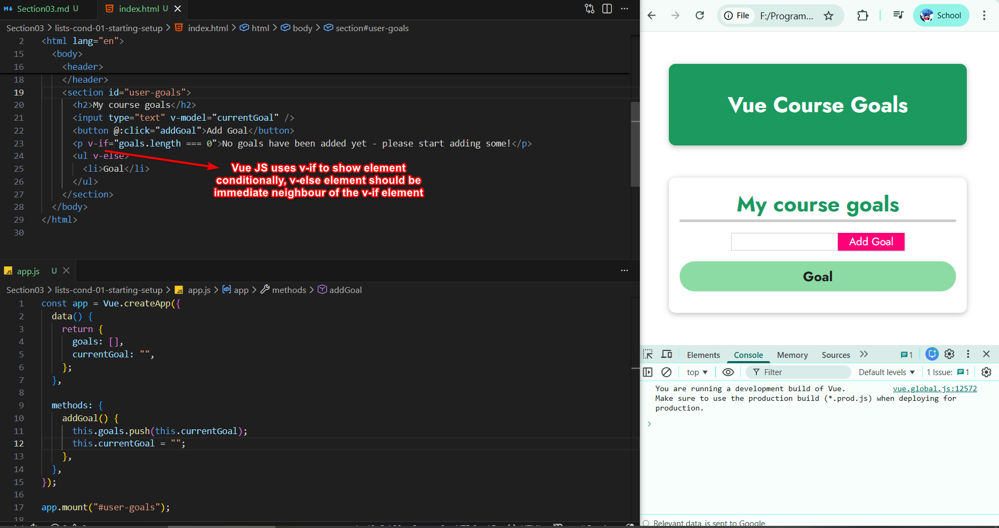
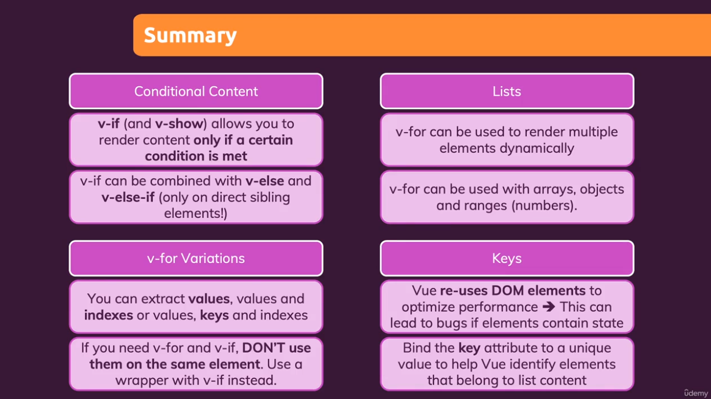

# Section 03 - Rendering Conditional Content and Lists

## Rendering Content Dynamically Using `v-if` and `v-else`

`v-if` and `v-else` adds and removes element completely from DOM dynamically



## Rendering Content Dynamically Using `v-show`

`v-show` show and hide element dynamically by adding css property to `display: none;`

``` html
<section id="user-goals">
    <h2>My course goals</h2>
    <input type="text" v-model="currentGoal" />
    <button @:click="addGoal">Add Goal</button>
    <p v-show="goals.length === 0">No goals have been added yet - please start adding some!</p>      
    <ul>
      <li v-for="goal of goals">{{ goal }}</li>
    </ul>
</section>
```

## Rendering List Items using `v-for`

`v-for` is used to render list


## Summary


