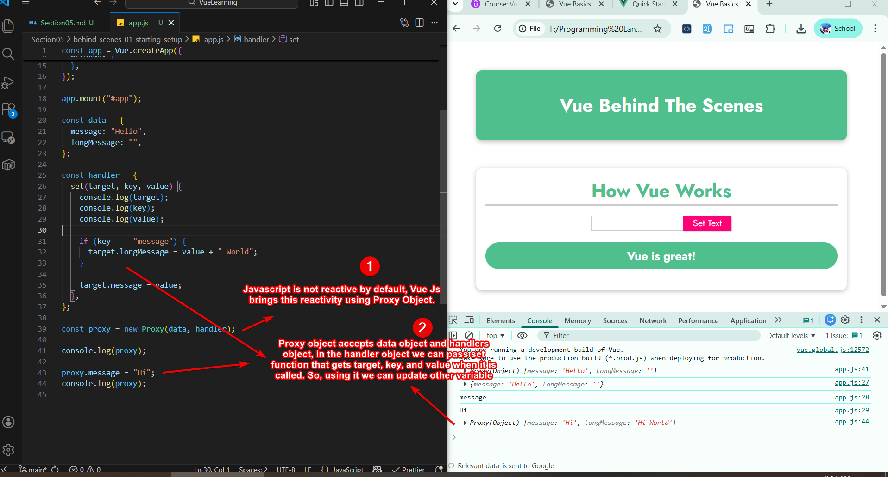
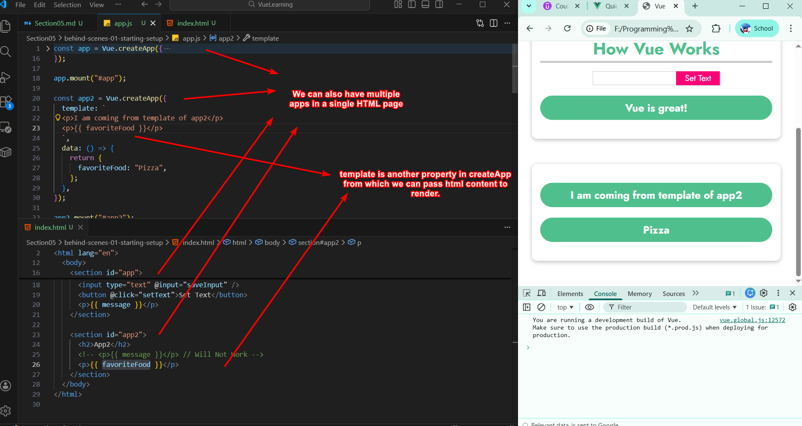
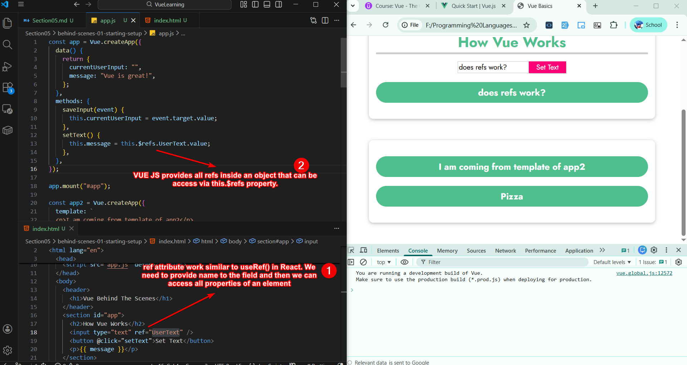
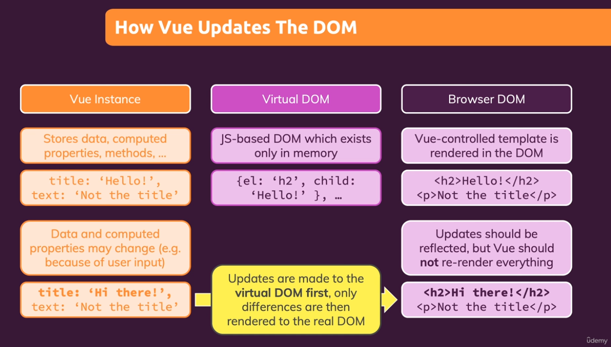
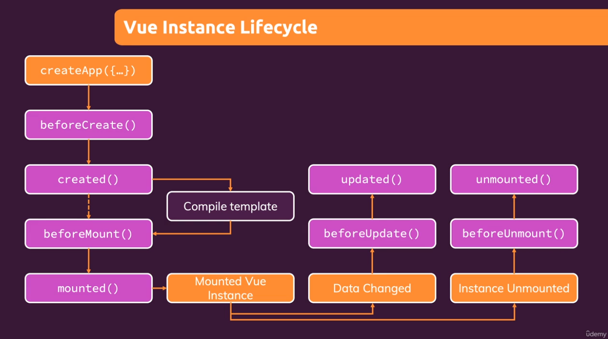
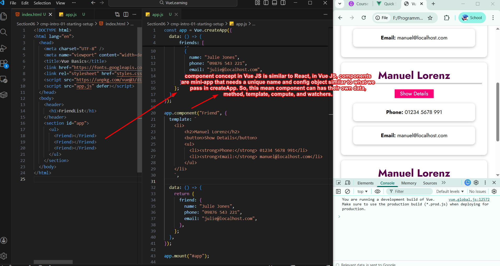

# Section 05 - Vue: Behind The Scenes

## Vue Reactivity



Vue brings **reactivity** to its functionality using `Proxy` object.

## Multiple Apps and Template



We can definately **have multiple apps** in a single html page and from `template` property we can **pass html content to render**.

## `Ref` to Access Element Properties



We can access element properties of an element using **ref attribute** and to access these properties Vue JS provides build-in propert `$refs` that hold key:value pair for all refs provided in HTML document.

## Virtual DOM



Just like React, Vue JS also maintain a copy of **virtual DOM** that it uses to update only those elements that change in actual DOM.

## Vue Lifecycle



These are some of the **hooks** that VUE JS provides at **different stages of its lifecycle**. We can used them as property accepting function inside `createApp` method.

``` javascript

const app = Vue.createApp({
  data() {
    return {
      currentUserInput: "",
      message: "Vue is great!",
    };
  },

  methods: {
    saveInput(event) {
      this.currentUserInput = event.target.value;
    },
    setText() {
      this.message = this.$refs.UserText.value;
    },
  },

// this hook will run before app is being created.
  beforeCreate() {
    console.log(`beforeCreated()`);
  },
});
```

## Components

Components are **mini-app** that needs **unique identifier** and **config object**. This config object is similar to what we pass to createApp method. So this means components **can have their own data, methods, computed properties, etc**.

