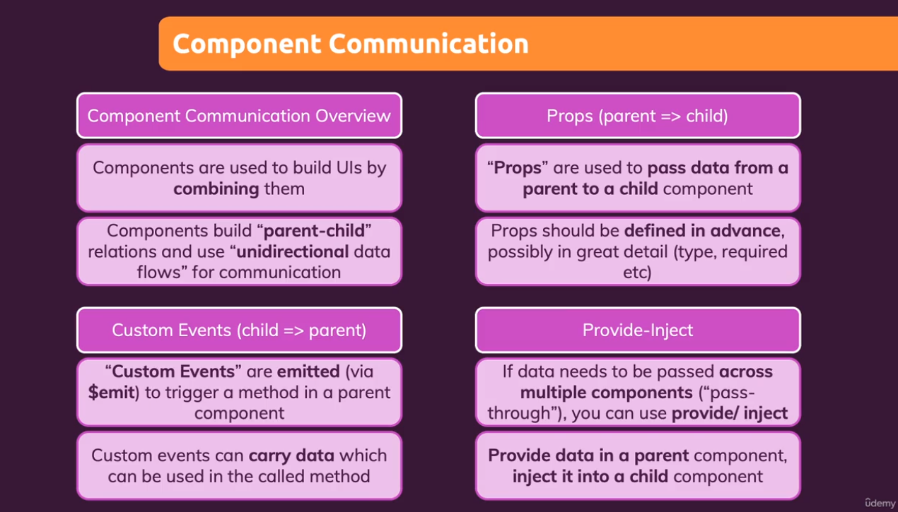

# Section 07 - 08 - Components Introduction

## Creating Components

In Vue, you need to create component, register it, and then use it.

## Props and Mutating Their Values

Props are used to **pass data inside components**, but Vue JS **doesn't allow changing their values**. 

One way to change prop value is **accepting them as initial state** of one of the data properties and then **changing it through methods**.

## Dynamic Props

To make our props values dynamic, we need to bind them using `v-bind`

## Child to Parent Values Passing (aka *Lifting the State Up*)

To pass value from **child to parent**, we need to **create custom event** using `$emit` built-in method that accepts **custom event name** and any amount of argument. 

> if your function emiting a custom event, you need to pass `emits` property in config object that accepts a string of array or an object containing name of custom event and validation.

## Emit Function Validation

We can validate emit function.

## Provide / Inject - *Equiv. useContext*

Vue allows **Provide** and **Inject** properties that is similar to createContext and useContext in React. 

In parent app (**App.vue**), you can pass `provide` key in config object that accepts a function that should return an object containing key as variable and value as data.

Then in child app (**UserData.vue**) to can use this provided data, using `inject` property. Inject property accepts an array of strings containing name of keys that is provided in `provide` object.

> Provide/inject works only in parent/child relationship, it will not work in passing data to neighbour/sibling component. 

> Only use provide/inject only if you have pass-through component.

## Summary

