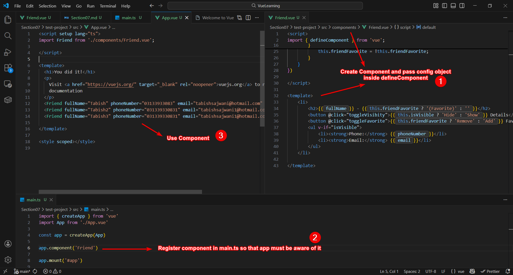
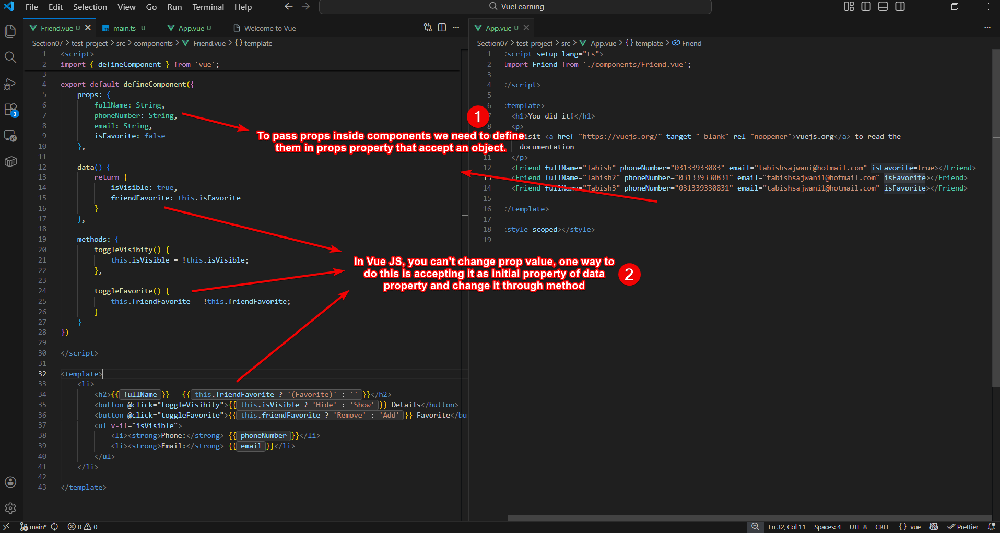
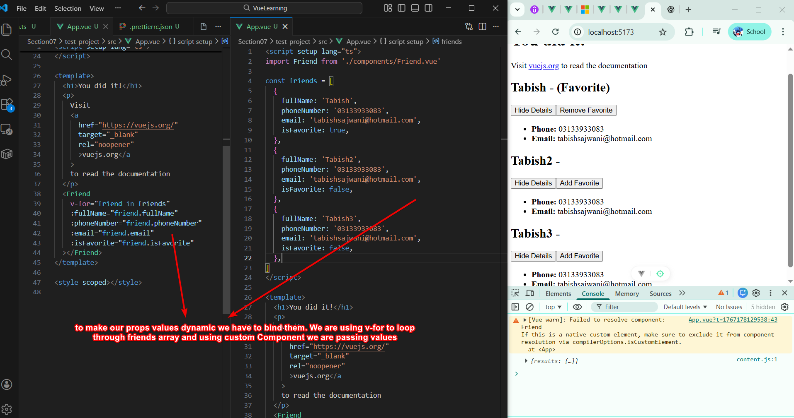
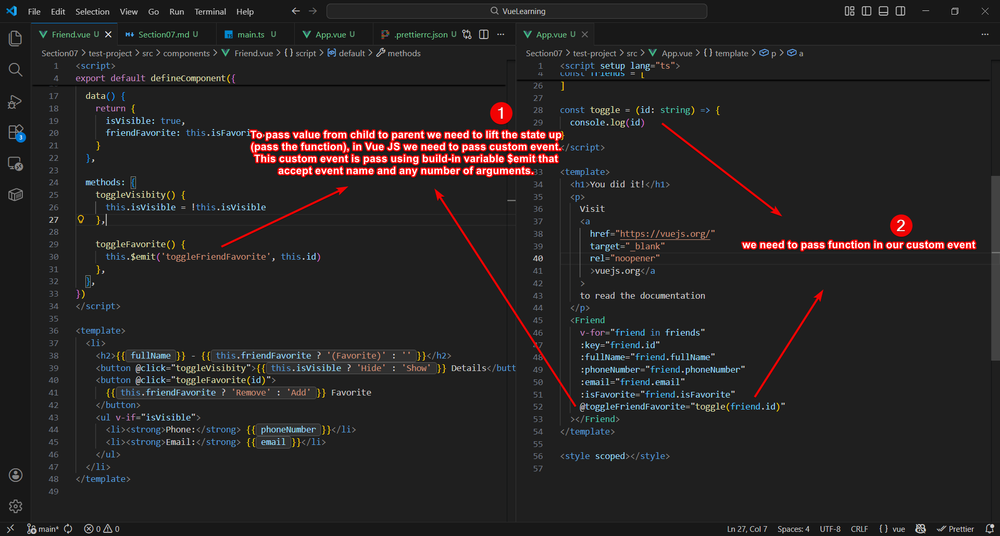
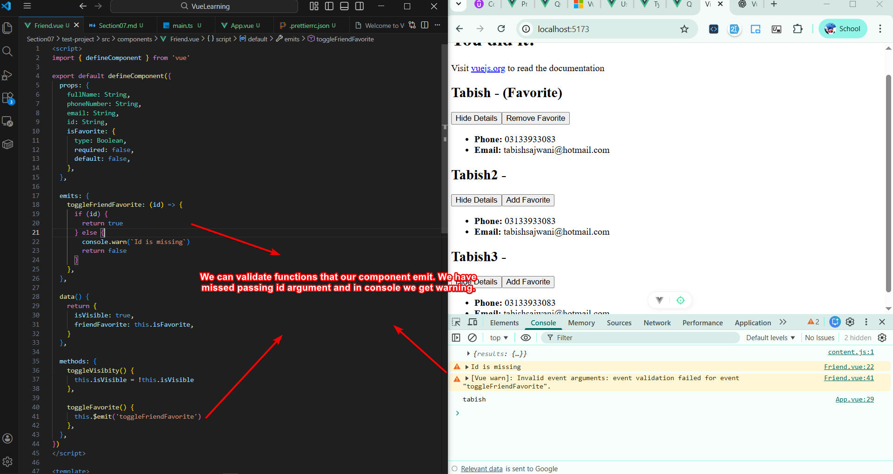

# Section 07 - 08 - Components Introduction

## Creating Components

In Vue, you need to create component, register it, and then use it.

## Props and Mutating Their Values

Props are used to **pass data inside components**, but Vue JS **doesn't allow changing their values**. 

One way to change prop value is **accepting them as initial state** of one of the data properties and then **changing it through methods**.

## Dynamic Props

To make our props values dynamic, we need to bind them using `v-bind`

## Child to Parent Values Passing (aka *Lifting the State Up*)

To pass value from **child to parent**, we need to **create custom event** using `$emit` built-in method that accepts **custom event name** and any amount of argument. 

## Emit Function Validation

We can validate emit function.