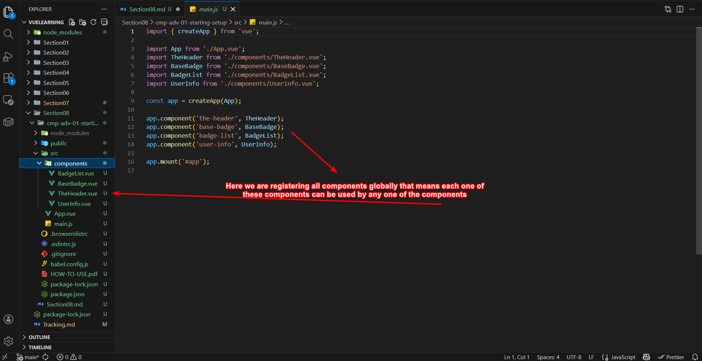
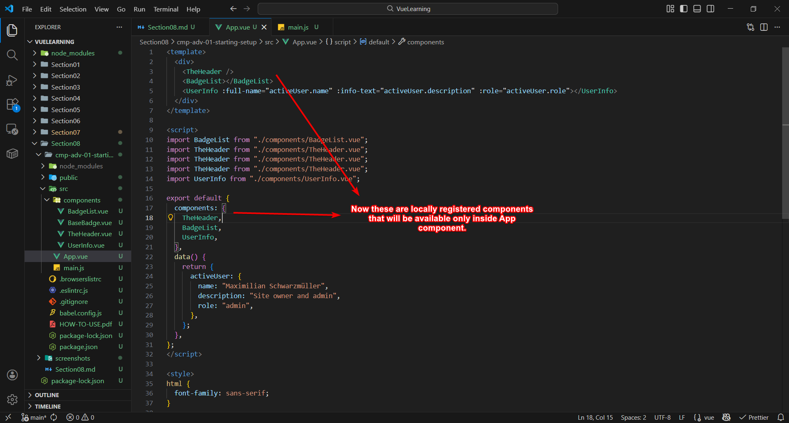
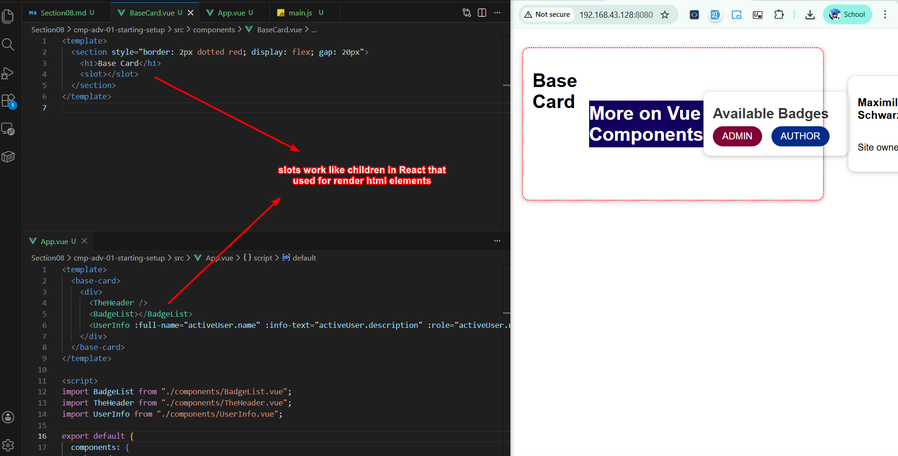
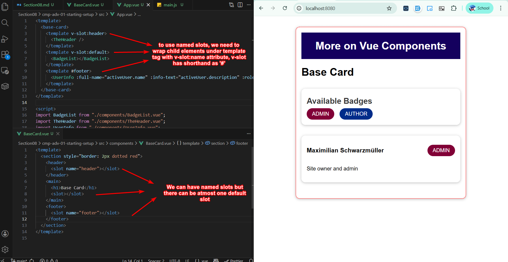
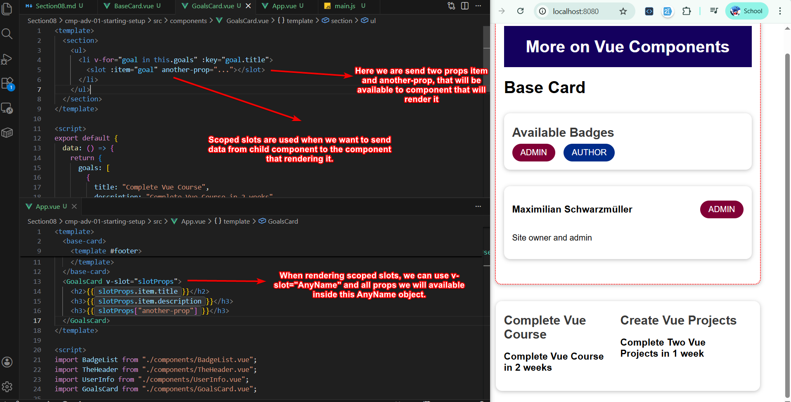
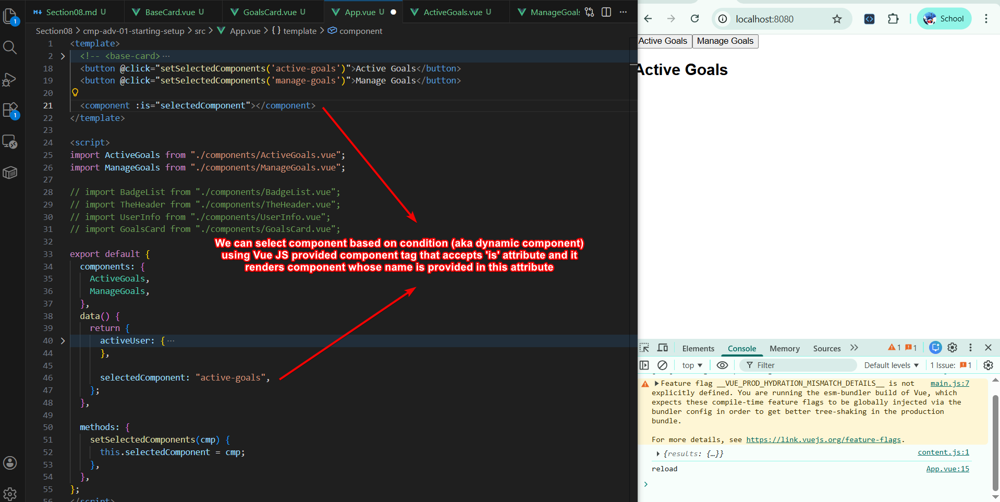
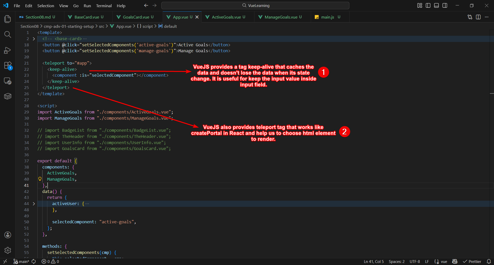
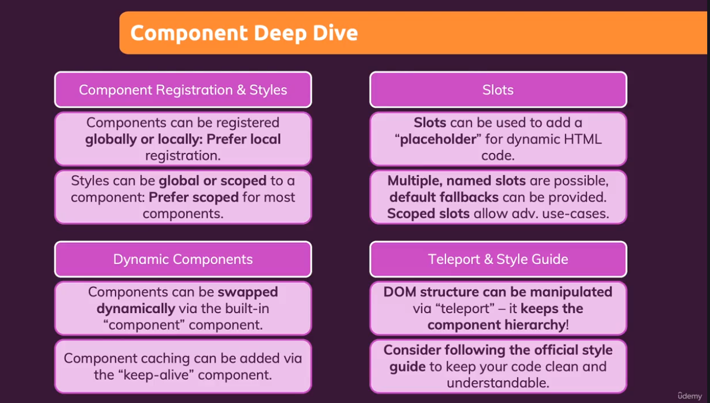

# Section 09 - Deep Drive In Component

## Globally Registered Components

**Globally** registered components are available globally.

## Locally Registered Components

**Locally** registered components are only available inside the component it is being registered.

## Slots *equiv. children* in React

### Named Slots

We can use **named slots** as well.

## Scoped Slots

When we want to pass data from component to the component that renders it, we need to use **scoped slots**.

## Dynamic Components

Vue JS provide us `component` tag that accepts `is` attribute to render component whose name is provided.

## Keep-Alive and Teleport

`Keep-alive` tag caches the data and prevent losing data when state of component changes. `Teleport` allows us to choose html element to render the element.

# Section 09 - Summary
