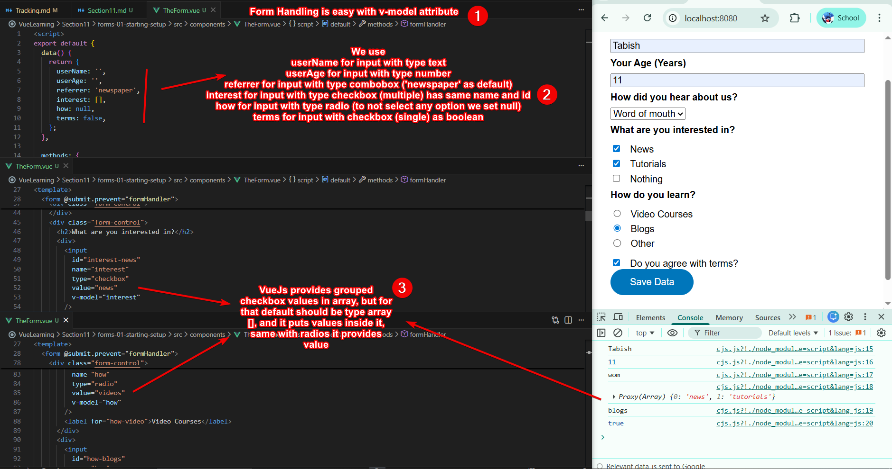
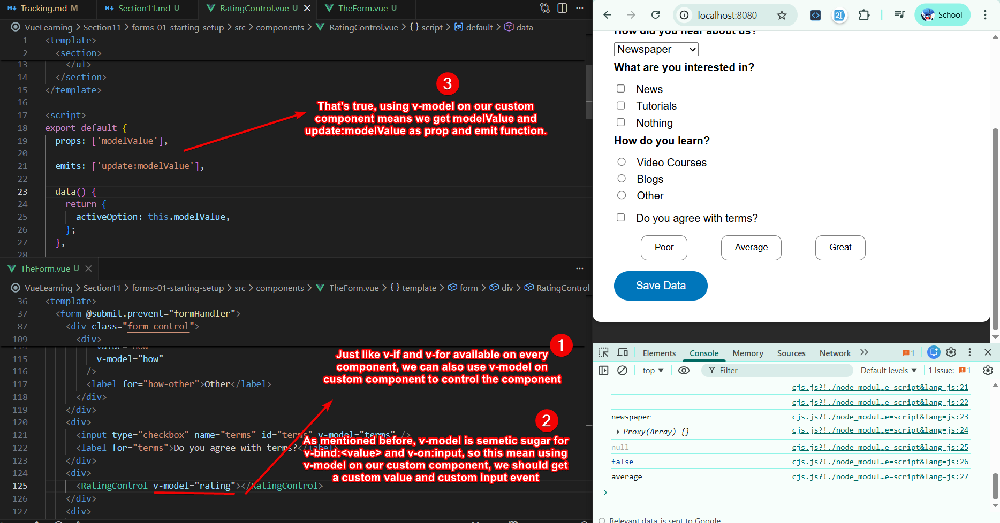

# Section 11 - Forms

## `v-model` Vs. `Ref`

If the `type='number'` of an input field is `number` then v-model automaically converts the input string to number and return it, while ref will return string as usual everything doesn't matter type of an input field.

## Form Handling

Using `v-model`, we can easily handle input fields with type text, number, checkboxes (group), radios, and checkbox (single) 

## Custom Component Controlling

Using `v-model` on our custom component means we will get `modelValue` and `update:modelValue` in our custom component. This comes handy to send value when we submit form.

