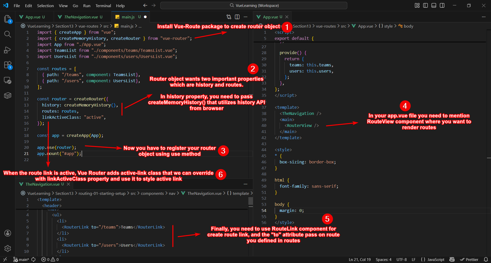
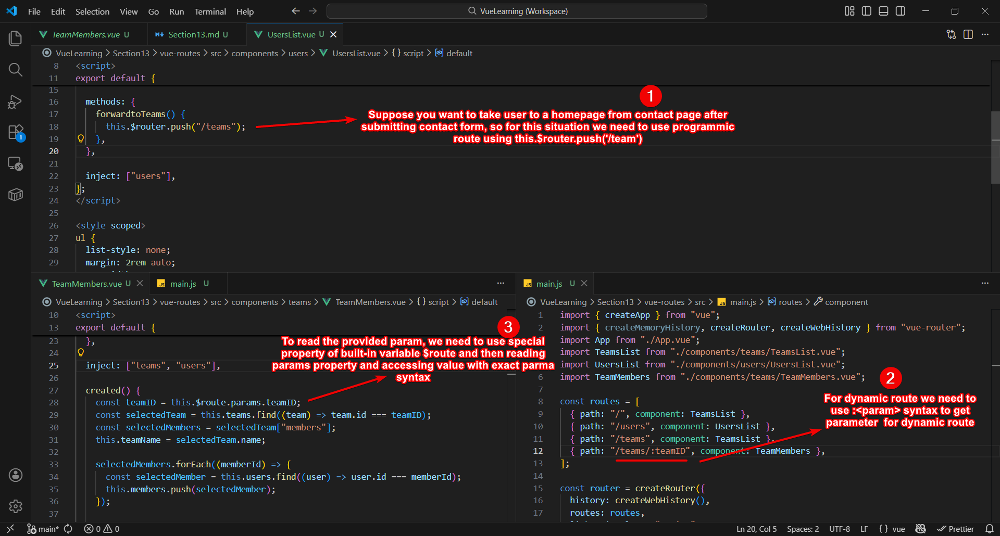
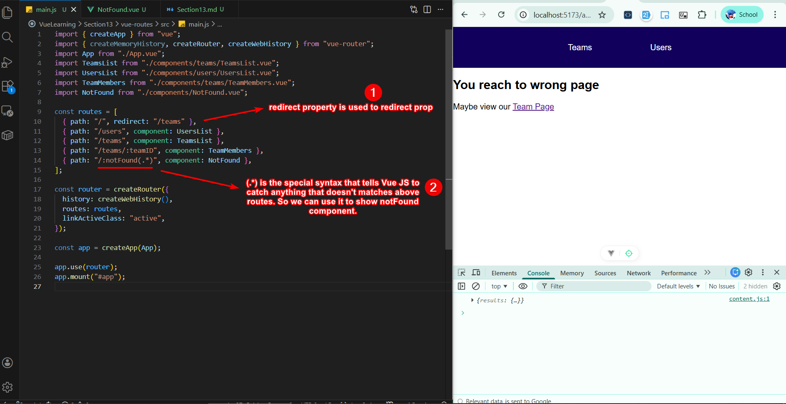
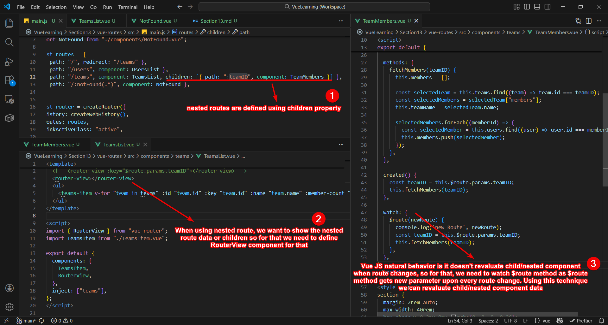
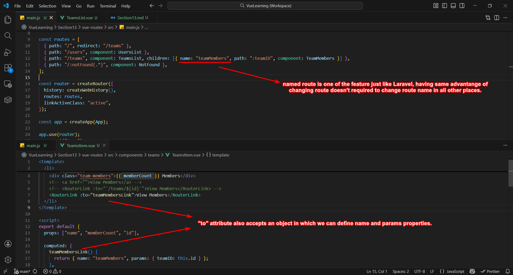
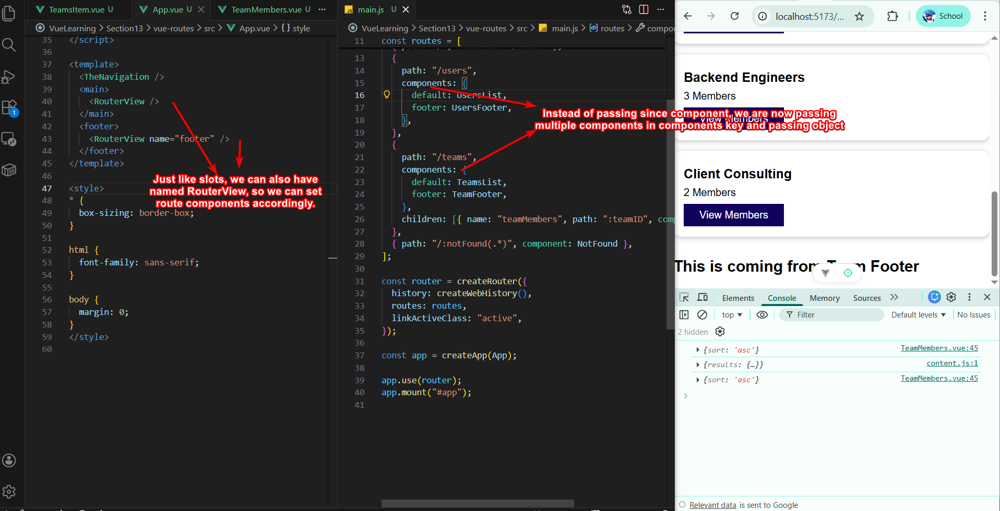

# Section 13 - Vue Routes

## Setting Up Routes

There are six steps you need to follow to create routes.



## Programmic and Dynamic Routes:

**Programmic routes** are those route that we can take user to another page programmicly.

**Dynamic routes** are those routes in which we send `parameter` with route.



## Redirecting and CatchAll routes

We can easily redirect link using `redirect` property and we can use catchAll syntax to show not found component.



## Nested Route

Nested route is used when we want to load nested component data inside a route.



## Named Routes

We can used named routes to avoid changing route in all other places if we decide to change route.



## Query Parameters

We can also pass query parameters inside the above object.

``` javascript
computed: {
    teamMembersLink() {
      return { name: "teamMembers", params: { teamID: this.id }, query: { sort: "asc" } };
    },
  },
```

## Named RouterView

Named routerView work similar to slots in which you can assign `default` as well as `named` components.



## ScrollBehavior

We can control user scroll position when component is accessed.

``` javascript
const router = createRouter({
  history: createWebHistory(),
  routes: routes,
  linkActiveClass: "active",
  scrollBehavior(to, from, savedPosition) {
    console.log(to, from, savedPosition);

    if (savedPosition) {
      return savedPosition;
    }

    return { left: 0, top: 0 };
  },
});
```

`to` and `from` are route object and `savedPosition` is the object containing `left` and `top` property that we can used to make user to scrollToTop when component loads.

## Navigation Guards

Navigation Guards works like middleware in which you can check and validate request.

### Global Guard

Global Guard is applied on router object as this guard will run on every route run.

``` javascript
router.beforeEach((to, from, next) => {
  console.log(to, from);
  // next(false);  // block the request
  // next('/users') // redirect to users route
  // next({ name: "teamMembers", path: ":teamID", component: TeamMembers }) // redirect to users route
  next();  
});
```

## Route Level Guard

Guards can be applied on route level as well using `beforeEnter` key that accepts function

``` javascript
{
    path: "/users",
    components: {
      default: UsersList,
      footer: UsersFooter,
    },

    beforeEnter(_, _2, next) {
      console.log(`before enter page guard`);
      next();
    },
  },
```

## Component Level Guard

Guards are also present on components. You can use `beforeEnterRoute` or `beforeUpdateRoute` 

``` javascript
export default {
  components: {
    UserItem,
  },

  data() {
    return {
      teamName: "",
      members: [],
    };
  },

  beforeRouteEnter(to, from, next) {
    console.log(`from before route enter`);
    console.log(to, from);
    next();
  },

  beforeRouteUpdate(to, from, next) {
    console.log(`from before route enter`);
    console.log(to, from);
    next();
  },

};
```

## Before Leaving Guard

Sometime you want to warn user for unsave changes before leaving the page, for this you can use `beforeRouteLeave`

``` javascript
export default {
  components: {
    UserItem,
  },

  methods: {
    forwardtoTeams() {
      this.$router.push("/teams");
    },
  },

  inject: ["users"],

  beforeRouteLeave(to, from, next) {
    console.log(`from before route leave`);
    console.log(to);
    console.log(from);
    const confirmAnswer = confirm("Are you sure you want to leave?");
    next(confirmAnswer);
  },
};
```

## MetaData

In some cases you want to send a custom data with every route. For this you can utilize `meta` property on route object.

``` javascript
{
    path: "/users",
    meta: { customData: true },
    components: {
      default: UsersList,
      footer: UsersFooter,
    },

    beforeEnter(to, from, next) {
      console.log(`before enter page guard`);
      console.log(to.meta.customData);
      console.log(from);
      next();
    },
},
```

