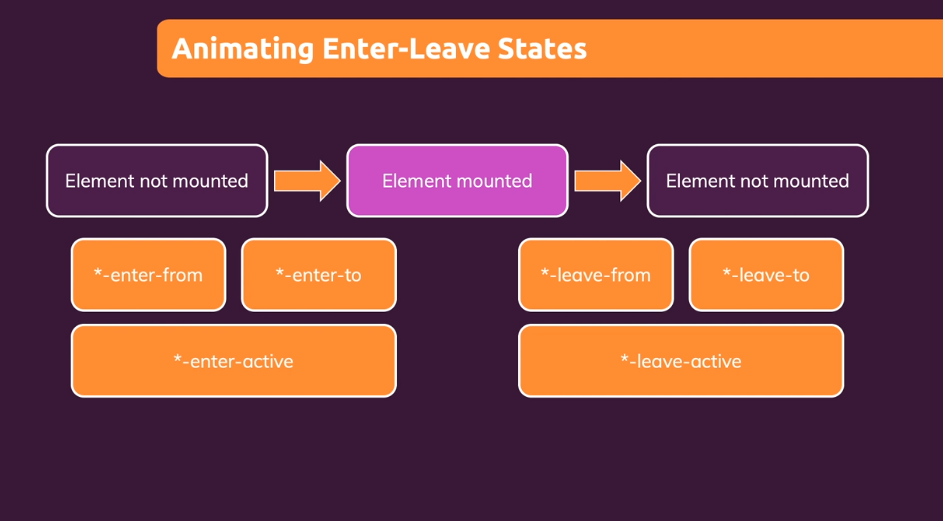
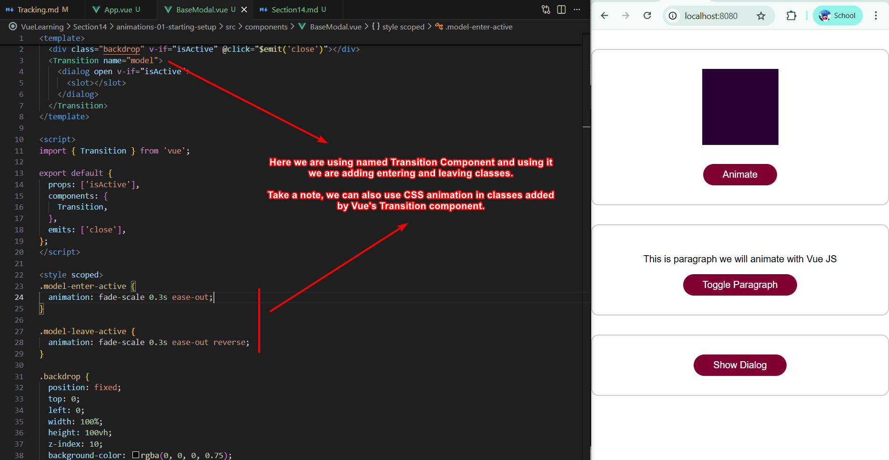
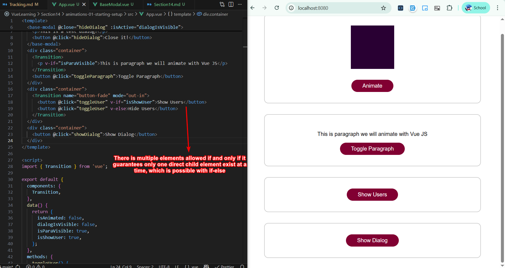
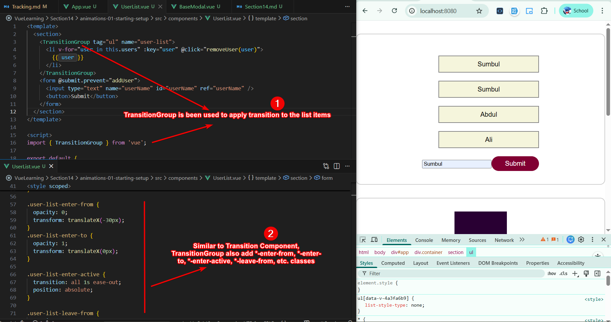

# Section 14 - Vue Animation

## Why Vue Animation Is Required?

When we apply CSS animation using animation or transition property then these properties applies only when element appears on screen, not when element leave the screen. 

To tackle this, Vue offers transition tag that allows only one child element. This transition tag monitors element appears using various classes.



## Transition Component

As mentioned above build-in Transition Components adds six classes.


Two important modifications:
1. **Named Transition Component:** using `name` attribute on Transition component, you can make this component named Transition block and now you can define `.para-enter-from`, `.para-enter-to`, `.para-enter-active` and so on... to define transitions while para is define as `name="para"` in Transition component.
2. **Custom Transition Classes:** You can also customized these transition classes by passing your custom classes in `enter-from-class=""`, `enter-to-class=""` attributes in Transition component.

## Named Transition To Animate Modal



!!! tip
    Always remember, `Transition` component works if and only if there is **atmost one** direct child element.

## Multiple Child Elements in Transition Component



> `mode` attribute defines how animation/transition will kick in, with `out-in` mode, animation first applies to leaving element, and then appearing element.

## Transition Events

`Transition` components provides various events such as `beforeEnter`, `beforeLeave`, `Leave`, `Enter`, etc. that you can utilize to enter custom functions. 

``` javascript
<Transition name="model" @before-leave="" @enter="" @leave="">
    <dialog open v-if="isActive">
      <slot></slot>
    </dialog>
</Transition>
```

## TransitionGroup

`TransitionGroup` is being used to apply transition effect on a list of items.



