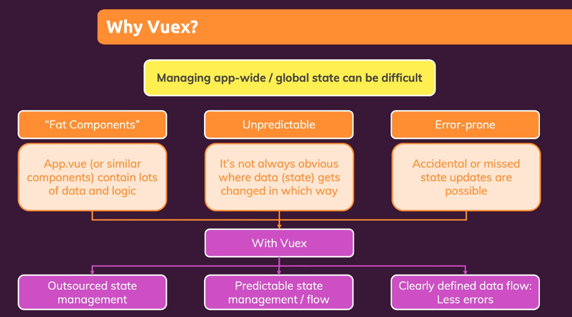
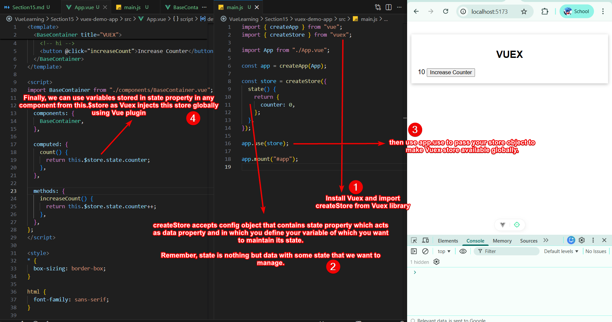
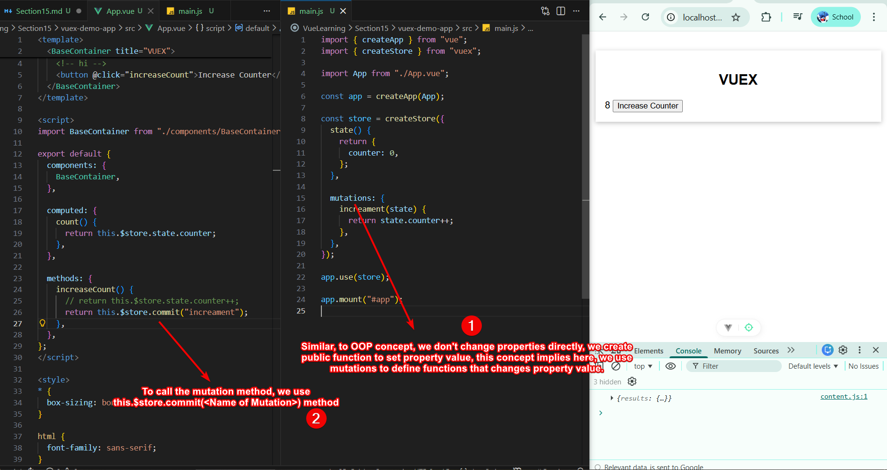
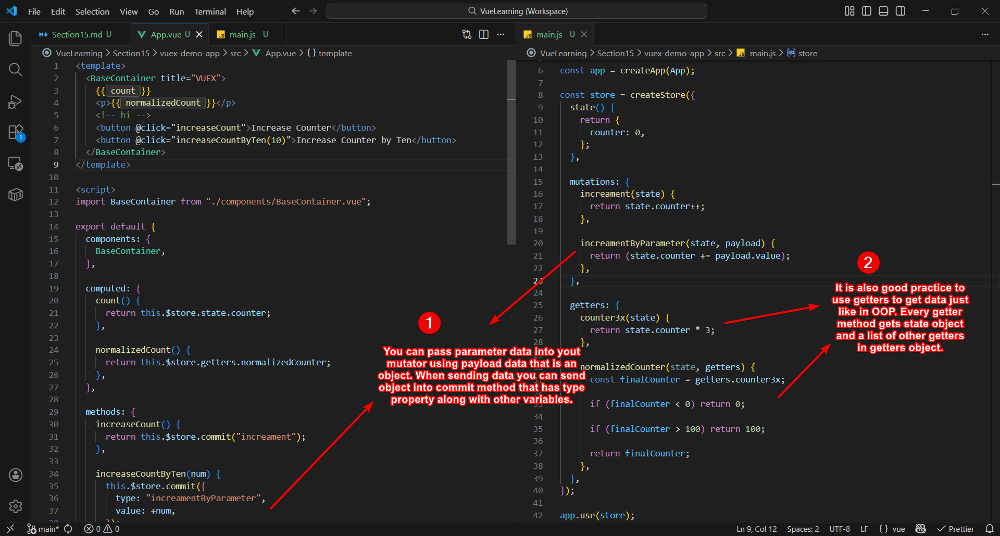
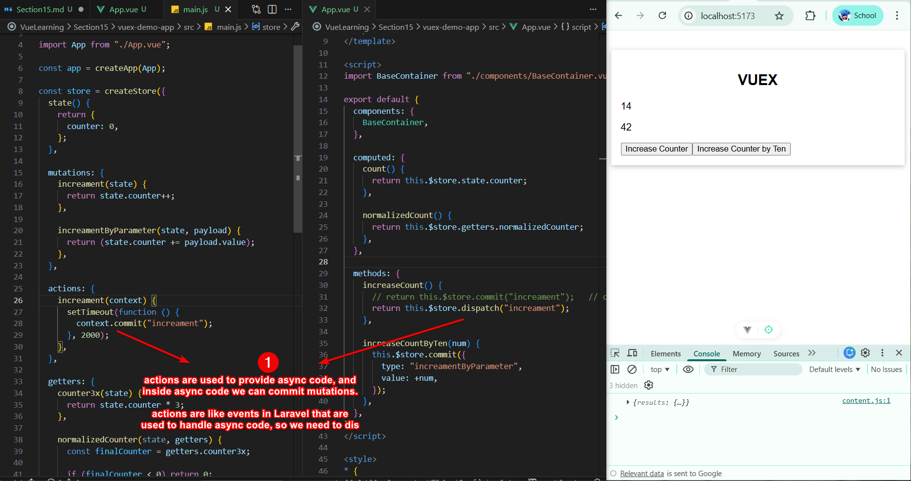
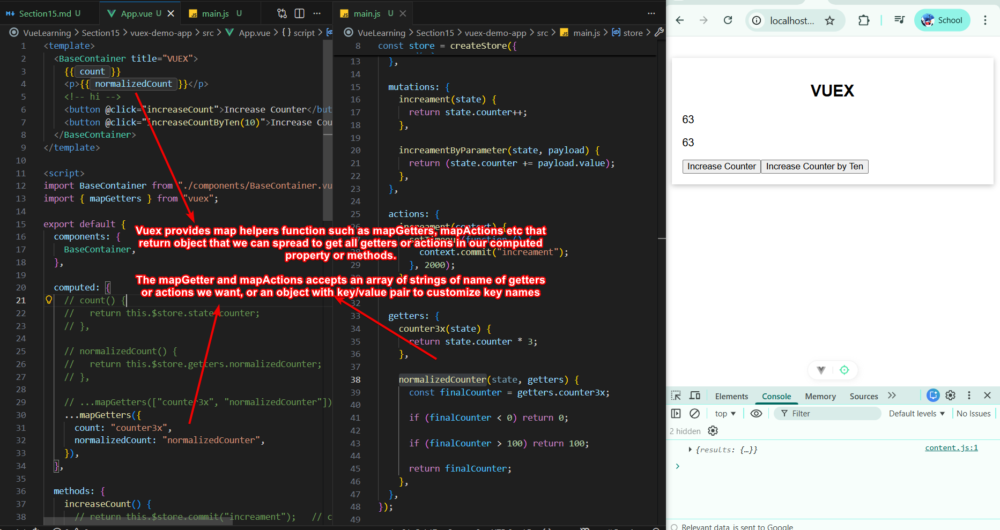
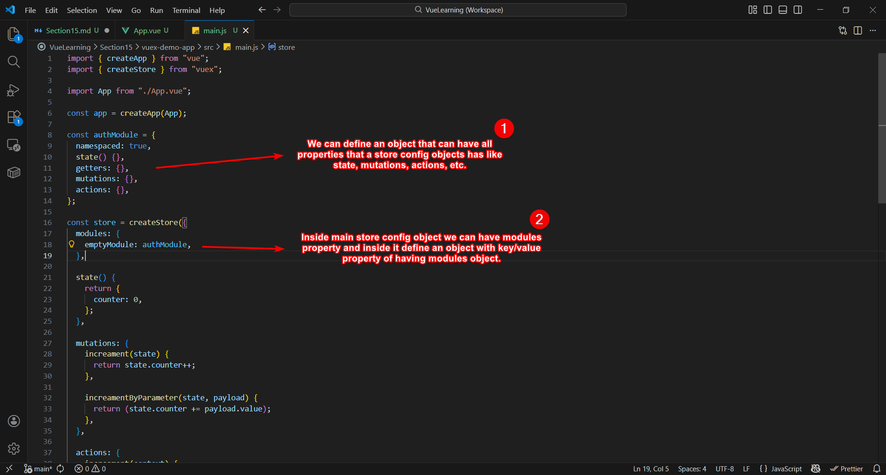
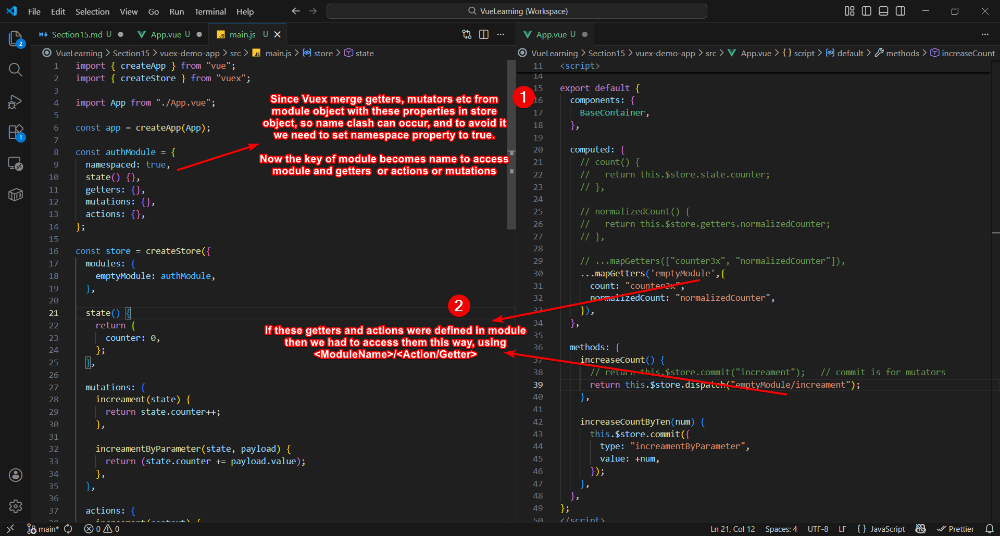

# Section 15 - Vuex

**Vuex** is similar to Redux in React in which we create store to manage state (data). 

It is an alternative to provide/inject because using provide and inject can make possible for every component to read data.

> Chatgpa suggest to skip Vuex and study Pinia

## Setting Up Vuex Store

You can setup Vuex Store by following four steps:

## Mutators and Getters

## Mutations

We use mutations to change property value instead of changing directly.

### Parameterized Mutators and Getter

You can send data into parameterized mutators using `payload` object.

Also, its good practice to get data using getters.

### Actions

Actions are similar to Mutators and they are used for two reasons:
1. Instead of mutating the state, actions commit mutations
2. Actions can contain arbitrary **asynchronous operations**

## Map Helpers

If you want to access getters into your `computed` property or actions in your `methods` property, you can easily spread map helpers function as they return object containing defined getters and actions.

## Modules

When our app grows, our store also grows. To tackle this problem, we need to use modules. Modules are basically an object that has same properties like state, getters, mutators, actions, etc.

Vuex merge all properties together, but name clash can occur and for this reason we have namespace.

### Namespace Modules

