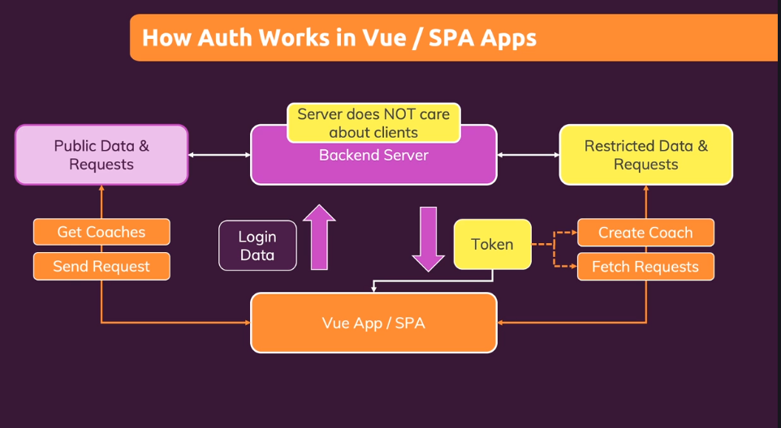
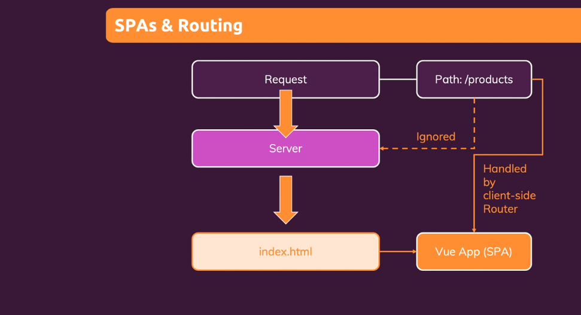

# Section 17 - Vue Authentication and Authorization

> I didn't get Firebase Web API in project settings so I skipped this part. Also, most of the time we will not use Firebase for database.

# Section 18 - Deployment

Most of the part you already know like you need to run `build` command to create `dist` folder that should be uploaded.

## SPA Vs. Non-SPA

In non-SPA app, browser will **look for `products` folder** when user access tabishsajwani.com/products. 

In SPA-app, browser will **ignore `/products` route and everytime return index file** that will handle `/products` route itself like loading products component/page.