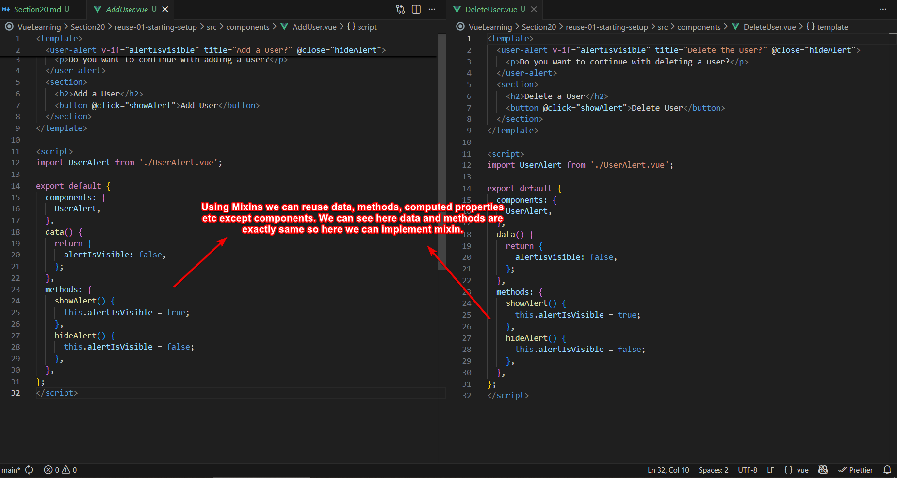
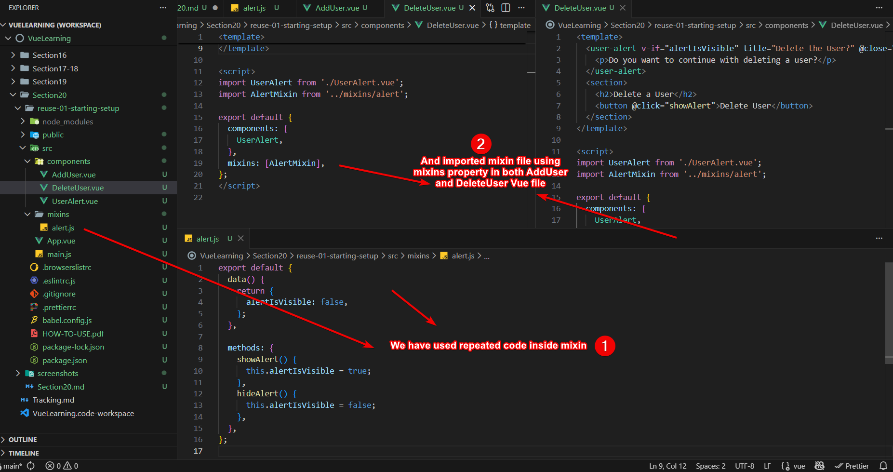
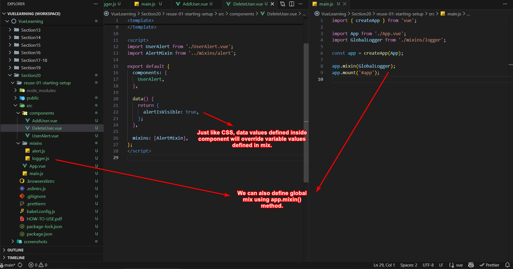
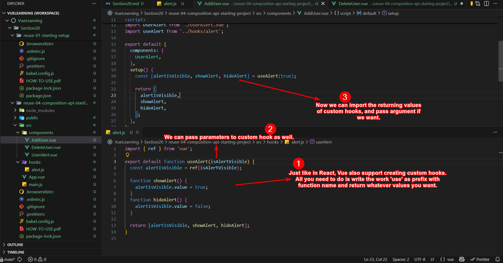

# Section 20 - Reusing Functionality - Mixins & Custom Composition Functions

## Mixin In Option API

Mixin is used in Option API when we have exactly same `data`, `methods`, `computed properties`, and `watchers`. However, `components` property can't be used.

**Before Mixin**

**After Using Mixin**

**Global Mixin**

## Custom Hook in Composition API

